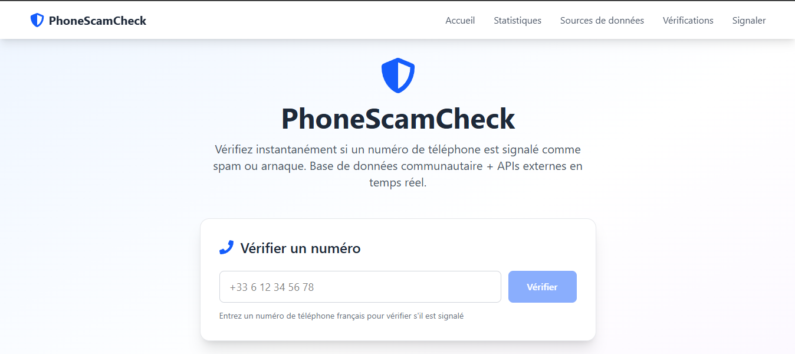
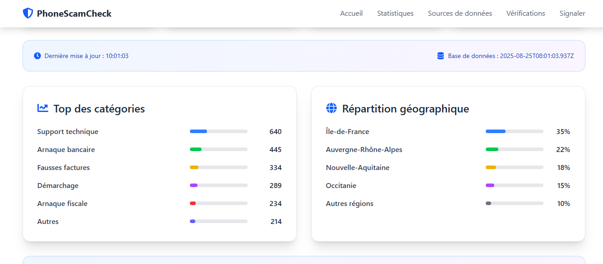
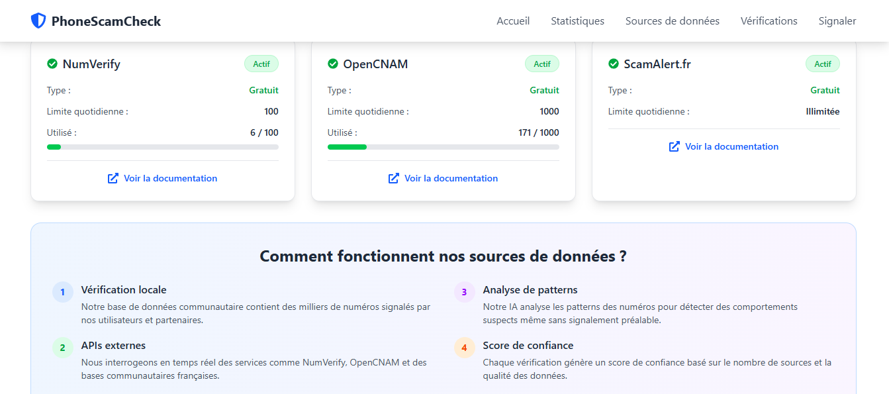

# 📱 PhoneScamCheck - Détecteur d'Arnaques Téléphoniques

> **Site à la Have I Been Pwned" pour vérifier si un numéro de téléphone est signalé comme spam/arnaque**

## 🖼️ **Captures d'Écran du Projet**

### 📱 **Interface Principale - Vérification de Numéros**

*Vérification d'un numéro de téléphone avec résultats détaillés et niveau de risque*

### 📊 **Statistiques en Temps Réel**

*Tableau de bord avec statistiques communautaires et top catégories d'arnaque*

### 🧪 **Test du Service TrueCaller**

*Composant de test du service TrueCaller avec analyse de réputation*

## 🚀 **Concept**

PhoneScamCheck est un site web qui permet aux utilisateurs de vérifier si un numéro de téléphone est signalé comme spam ou arnaque. Inspiré de "Have I Been Pwned", il combine :

- **Vérification multi-sources** : Base locale + APIs externes
- **Crowdsourcing** : Les visiteurs signalent eux-mêmes les numéros suspects
- **Analyse automatique** : Détection de patterns suspects
- **Interface moderne** : Design responsive et intuitif

## ✨ **Fonctionnalités Principales**

### 🔍 **Vérification de Numéros**
- **Recherche instantanée** par numéro de téléphone
- **Validation française** (+33 ou 0XXXXXXXXX)
- **Résultats détaillés** avec niveau de risque et confiance
- **Sources multiples** : Base locale + APIs externes

### 📊 **Statistiques en Temps Réel**
- **Nombre total** de signalements
- **Répartition** arnaques vs spam
- **Top catégories** d'arnaque
- **Utilisateurs actifs** et vérifications du jour

### 🚨 **Signalement Communautaire**
- **Formulaire de signalement** pour nouveaux numéros
- **Catégorisation** automatique (support technique, bancaire, etc.)
- **Enrichissement** de la base de données
- **Validation** des signalements

### 🔧 **APIs Intégrées**
- **NumVerify** : Validation des numéros (gratuit)
- **OpenCNAM** : Réputation téléphonique
- **ScamAlert.fr** : Base française des arnaques
- **TrueCaller** : Service de réputation (simulé)
- **Analyse automatique** des patterns suspects

## 🛠️ **Technologies Utilisées**

- **Frontend** : React 18 + Vite
- **Styling** : Tailwind CSS
- **Icons** : React Icons (FontAwesome)
- **Architecture** : Services modulaires + composants React
- **Environnement** : Variables d'environnement Vite

## 🚀 **Installation et Démarrage**

### **Prérequis**
- Node.js 18+ 
- npm ou yarn

### **Installation**
```bash
# Cloner le projet
git clone https://github.com/username/PhoneScamCheck.git
cd PhoneScamCheck

# Installer les dépendances
npm install

# Copier la configuration
cp .env.example .env

# Configurer les clés API (optionnel)
# Éditer .env avec tes vraies clés
```

### **Démarrage**
```bash
# Mode développement
npm run dev

# Ouvrir http://localhost:5173
```
